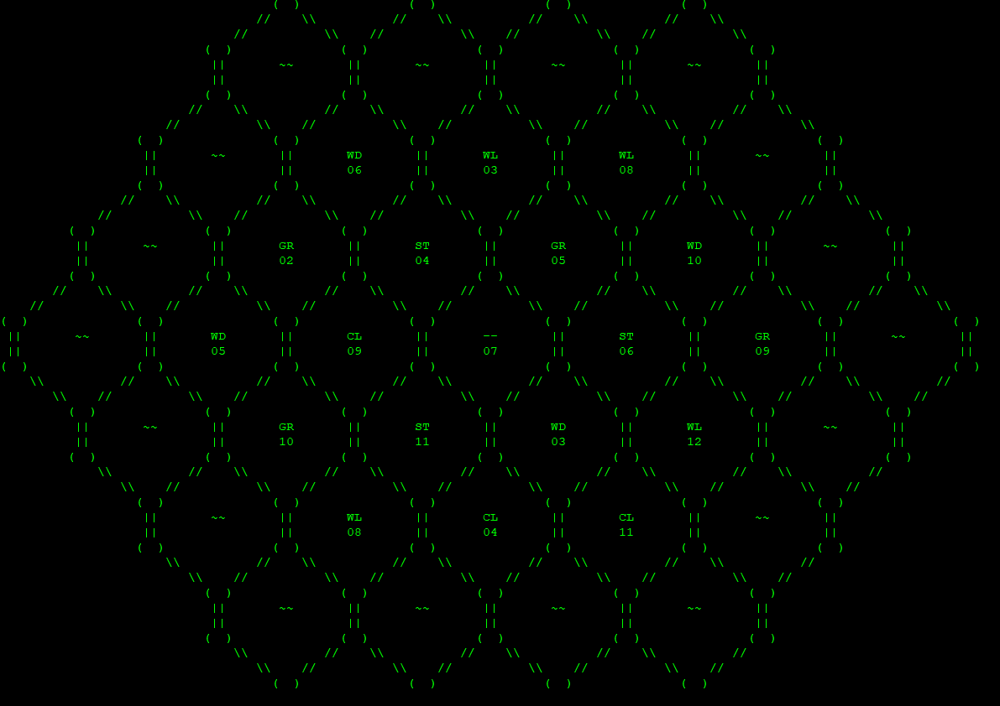

## Project Group
gruppe102-einhoerner-projekt2-siedler

## Group Members
@hadiala1 @kuendkun @luethsil @nguyesyd

## Project Name
Siedler

## Project Description, Manual, Meeting Minutes and Tests

Look at our [Wiki-Page](https://github.zhaw.ch/pm1-it19azh-ehri-fame-muon/gruppe102-einhoerner-projekt3-siedler/wiki) for more information.

## Getting started
You can clone the application by running this command on your console/shell:
```
git clone https://github.zhaw.ch/pm1-it19azh-ehri-fame-muon/gruppe102-einhoerner-projekt3-siedler.git
```

The class `SiedlerGame` contains the main method and is responsible for launching the game.
After launching the default game layout will be created and every step is then described in the application itself.

For further Information on our project management, please look at our [Wiki-Page](https://github.zhaw.ch/pm1-it19azh-ehri-fame-muon/gruppe102-einhoerner-projekt3-siedler/wiki)

 

